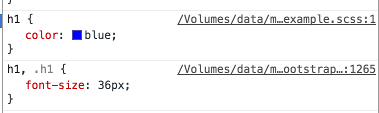
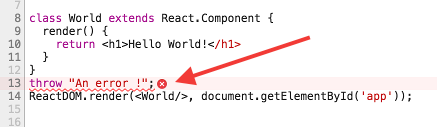

# Minimum React ES6 Bootstrap SCSS Webpack2 Sourcemaps

The purpose of this minimum boilerplate is to start coding right away React with ES6 using Bootstrap library with SCSS and JSX sourcemaps. This is only display H1 `Hello World!` as example.

This webpack configuration is not intended to be in production mode!

Happy coding !


## Steps
Install dependencies
```
$ npm i
```

To run webpack dev server:
```
$ npm run dev
```
The `Hello World!` page is at : [http://localhost:8080/](http://localhost:8080/)

## scss sourcemaps


## jsx sourcemaps

