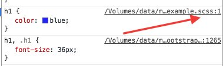

# react-es6-bootstrap-scss with webpack 2
React + ES6 + Bootstrap + webpack 2 that display H1 `Hello World!`

Install dependencies
```
$ npm i
```

To run webpack dev server:
```
$ npm run dev
```

The `Hello World!` page is at : [http://localhost:8080/](http://localhost:8080/)




